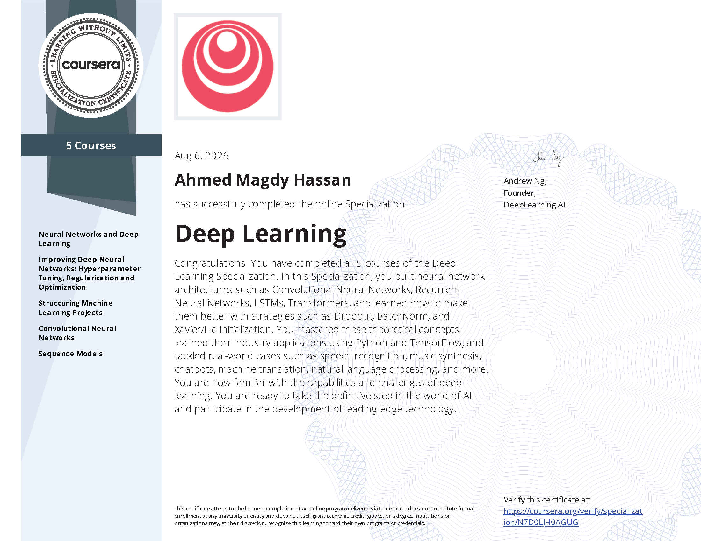

# Deep Learning Specialization

**DeepLearning.AI · Coursera**  
*Taught by Andrew Ng*

[](LICENSE)
[](https://www.python.org/)
[](https://jupyter.org/)
[](https://www.coursera.org/specializations/deep-learning)
[](https://git-lfs.com)

<p align="center">
  
</p>

A complete collection of **notes**, **programming assignments**, **quizzes**, and **course materials** from the Deep Learning Specialization on Coursera.

> This repository contains my personal solutions and notes while completing the specialization. It is intended for educational reference only.

---

## Environment Setup & Installation

> **Why this section is at the top:**  
> While taking these courses I faced many environment, dependency, and large-file issues (missing packages, version conflicts, broken notebooks, huge datasets/models that Git cannot handle normally, zipped archives that need extraction, etc.). I had to figure everything out myself.  
> This repository is set up so you **don’t have to go through the same pain**. The environment has been fully configured and tested — all notebooks across the five courses run without errors when you follow the steps below.

> **Tested environment:** Python **3.12** + `requirements.txt`  
> **Large files:** Git LFS is required (datasets `.h5`, models, `.zip` archives, videos, large CSVs, etc.)

### Important: Git LFS (Large File Storage)

This repository uses **Git LFS** for many large files (`.h5`, `.zip`, `.mp4`, `.npy`, large `.csv`, etc.).

- If you clone **without** Git LFS installed, you will only get tiny *pointer* files and the notebooks will fail.
- After installing Git LFS you must run `git lfs pull` (or use the setup script below).

**Install Git LFS** (one-time):

| Platform       | Command / Link                                      |
|----------------|-----------------------------------------------------|
| Windows / macOS| [https://git-lfs.com](https://git-lfs.com)          |
| Ubuntu/Debian  | `sudo apt install git-lfs`                          |
| Fedora         | `sudo dnf install git-lfs`                          |
| macOS (brew)   | `brew install git-lfs`                              |

Then:

```bash
git lfs install
```

### Recommended: Use the Interactive Setup Script

The easiest way to set everything up is to use the provided interactive script. It will:

1. Check / guide you on **Git LFS** and pull all large files
2. **Extract** every `.zip` archive found in the repo (and optionally delete the zips afterward to save space)
3. Let you choose **venv** or **Conda**
4. Install all packages from `requirements.txt`
5. Verify core packages and optionally launch Jupyter Lab

```bash
# 1. Clone the repository (Git LFS will download pointers; real files come later)
git clone https://github.com/Sober-Migo/Coursera_Deep_Learning_Specialization.git
cd Coursera_Deep_Learning_Specialization

# 2. Make sure Git LFS is installed, then run the setup script
python setup_env.py
```

The script works on **Windows**, **macOS**, and **Linux**.

---

### Manual Installation (Alternative)

#### 1. Clone + Git LFS

```bash
# Install Git LFS first (see table above), then:
git lfs install
git clone https://github.com/Sober-Migo/Coursera_Deep_Learning_Specialization.git
cd Coursera_Deep_Learning_Specialization
git lfs pull          # downloads all large files (datasets, zips, models, videos…)
```

#### 2. Extract the zip archives

Several assignments ship datasets or pretrained models as `.zip` files. Extract them (and optionally delete the zips):

```bash
# Example locations (the setup script does this automatically for all of them):
# C4 - Convolutional Neural Networks/.../datasets.zip
# C4 - .../ResNet50.zip
# C4 - .../yolo.zip
# C4 - .../data.zip
# C5 - Sequence Models/.../glove.6B.*.txt.zip
# C5 - .../model.zip
```

You can run a quick find + extract:

```bash
# From the repository root (Linux / macOS / Git Bash)
find . -name "*.zip" -not -path "./.git/*" -not -path "./venv/*" | while read z; do
  echo "Extracting $z"
  unzip -o "$z" -d "$(dirname "$z")"
  # rm "$z"   # uncomment to delete zip after extraction
done
```

#### 3a. Using venv

```bash
python -m venv venv

# Windows
venv\Scripts\activate

# macOS / Linux
source venv/bin/activate

pip install --upgrade pip
pip install -r requirements.txt

jupyter lab   # or jupyter notebook
```

#### 3b. Using Conda

```bash
conda create -n dl-specialization python=3.12 -y
conda activate dl-specialization

pip install --upgrade pip
pip install -r requirements.txt

jupyter lab
```

> **Note on PyTorch / CUDA:**  
> `requirements.txt` pins `torch==2.6.0+cu124` (and matching torchvision/torchaudio).  
> If you do **not** have a compatible NVIDIA GPU + CUDA 12.4, the install may fail or you can switch to a CPU build:
>
> ```bash
> pip install torch torchvision torchaudio --index-url https://download.pytorch.org/whl/cpu
> ```

The `requirements.txt` file contains the **complete set of packages** (with tested versions) needed to run every notebook in this repository without missing-dependency or version-conflict errors.

### Optional: Verify the environment

```bash
python -c "import numpy, pandas, sklearn, tensorflow, matplotlib, h5py; print('Core packages OK')"
python -c "import torch; print(f'PyTorch {torch.__version__} — CUDA: {torch.cuda.is_available()}')"
```

---

## Table of Contents

- [Environment Setup & Installation](#environment-setup--installation)
- [About the Specialization](#about-the-specialization)
- [Repository Structure](#repository-structure)
- [Course Overview](#course-overview)
  - [Course 1 – Neural Networks and Deep Learning](#course-1--neural-networks-and-deep-learning)
  - [Course 2 – Improving Deep Neural Networks](#course-2--improving-deep-neural-networks-hyperparameter-tuning-regularization-and-optimization)
  - [Course 3 – Structuring Machine Learning Projects](#course-3--structuring-machine-learning-projects)
  - [Course 4 – Convolutional Neural Networks](#course-4--convolutional-neural-networks)
  - [Course 5 – Sequence Models](#course-5--sequence-models)
- [Certificate](#certificate)
- [Tech Stack](#tech-stack)
- [Disclaimer](#disclaimer)
- [License](#license)

---

## About the Specialization

The **Deep Learning Specialization** is a foundational program created by **DeepLearning.AI**. In five courses you learn the foundations of Deep Learning, how to build neural networks, and how to lead successful machine learning projects. You will work on case studies from healthcare, autonomous driving, sign language reading, music generation, natural language processing, and more.

**What you will learn:**

- Build and train deep neural networks (MLP, CNN, RNN, LSTM, Transformers)
- Hyperparameter tuning, regularization, optimization (Adam, Dropout, BatchNorm, …)
- How to structure ML projects and diagnose errors
- Convolutional networks for computer vision (object detection, segmentation, style transfer, face recognition)
- Sequence models for NLP and time-series (language models, machine translation, attention, transformers)

---

## Repository Structure

```text
Coursera_Deep_Learning_Specialization/
├── C1 - Neural Networks and Deep Learning/
│   ├── Notes/
│   ├── Week 1 … Week 4/          # Quizzes, programming assignments, datasets
├── C2 - Improving Deep Neural Networks/
│   ├── Notes/
│   ├── Week 1 … Week 3/
├── C3 - Structuring Machine Learning Projects/
│   ├── Notes/
│   ├── Week 1 … Week 2/          # Case-study quizzes
├── C4 - Convolutional Neural Networks/
│   ├── Notes/
│   ├── Week 1 … Week 4/          # CNNs, ResNets, YOLO, U-Net, Neural Style Transfer, Face Recognition
│   │   └── (contains several .zip archives → extract after clone)
├── C5 - Sequence Models/
│   ├── Notes/
│   ├── Week 1 … Week 4/          # RNNs, LSTMs, Word Vectors, Emojify, Transformers, QA
│   │   └── (contains GloVe zips and model.zip → extract after clone)
├── DeepLearningCertificate.png
├── Deep Learning Specialization Certificate.pdf
├── requirements.txt
├── setup_env.py                  # Interactive setup (Git LFS + zips + venv/Conda + install)
├── LICENSE
├── .gitattributes                # Git LFS tracking rules
├── .gitignore
└── README.md
```

---

## Course Overview

### Course 1 – Neural Networks and Deep Learning

| Week | Topics | Materials |
|------|--------|-----------|
| **Week 1** | Introduction to Deep Learning | Notes · Quiz |
| **Week 2** | Neural Network Basics, Logistic Regression, Vectorization | Programming Assignments · Datasets |
| **Week 3** | Shallow Neural Networks | Programming Assignment |
| **Week 4** | Deep Neural Networks | Programming Assignments · Image Classification |

**Key Skills:** NumPy · Forward/Backward Propagation · Logistic Regression as NN · Deep NNs

---

### Course 2 – Improving Deep Neural Networks: Hyperparameter Tuning, Regularization and Optimization

| Week | Topics | Materials |
|------|--------|-----------|
| **Week 1** | Practical aspects, Regularization, Gradient Checking | Assignments · Images/Videos |
| **Week 2** | Optimization algorithms (Mini-batch, Momentum, Adam) | Assignments |
| **Week 3** | Hyperparameter tuning, Batch Norm, Multi-class | Assignments · Signs dataset |

**Key Skills:** Dropout · L2 · Adam · Batch Normalization · Hyperparameter search

---

### Course 3 – Structuring Machine Learning Projects

| Week | Topics | Materials |
|------|--------|-----------|
| **Week 1** | ML Strategy, Orthogonalization, Single-number evaluation | Case-study Quiz (Bird recognition) |
| **Week 2** | Error analysis, Mismatched data, Transfer learning | Case-study Quiz (Autonomous driving) |

**Key Skills:** How to prioritize work · Error analysis · Human-level performance · End-to-end vs pipeline

---

### Course 4 – Convolutional Neural Networks

| Week | Topics | Materials |
|------|--------|-----------|
| **Week 1** | CNN foundations, Convolution, Pooling | Assignments · datasets.zip |
| **Week 2** | Classic CNNs, ResNets, Transfer Learning (MobileNet) | ResNet50.zip · dataset.zip |
| **Week 3** | Object detection (YOLO), Image segmentation (U-Net) | yolo.zip · data.zip |
| **Week 4** | Face recognition, Neural Style Transfer | Assignments |

**Key Skills:** ConvNets · ResNet · YOLO · U-Net · Transfer Learning · Style Transfer

---

### Course 5 – Sequence Models

| Week | Topics | Materials |
|------|--------|-----------|
| **Week 1** | RNNs, GRUs, LSTMs, Character-level language models | Assignments |
| **Week 2** | NLP & Word Embeddings, Emojify | glove.6B.50d.txt.zip (×2) |
| **Week 3** | Sequence-to-sequence, Attention, Trigger word | Assignments |
| **Week 4** | Transformers, Preprocessing, Question Answering | glove.6B.100d.txt.zip · model.zip |

**Key Skills:** RNN / LSTM · Word2Vec / GloVe · Attention · Transformers · Seq2Seq · Named Entity / QA

---

## Certificate

<p align="center">
  
</p>

You can also view the original PDF certificate:

**[Deep Learning Specialization Certificate.pdf](./Deep%20Learning%20Specialization%20Certificate.pdf)**

---

## Tech Stack

| Category | Libraries / Tools |
|----------|-------------------|
| Core | Python 3.12, NumPy, Pandas, h5py |
| Deep Learning | TensorFlow / Keras, PyTorch |
| Computer Vision | OpenCV, Pillow |
| NLP | Transformers, NLTK, tokenizers |
| Audio / Music | librosa, music21, pydub |
| Visualization | Matplotlib, Seaborn |
| Environment | JupyterLab / Notebook |
| Large files | Git LFS |
| Others | See `requirements.txt` for the full pinned list |

---

## Disclaimer

This repository is created for **personal learning and educational purposes only**.

- The materials belong to **DeepLearning.AI** and **Coursera**.
- Solutions are shared to help fellow learners understand concepts, **not** to encourage academic dishonesty.
- Please attempt the assignments yourself first before referring to any solutions.
- Always respect Coursera’s Honor Code.

---

## License

This project is licensed under the **MIT License** – see the [LICENSE](LICENSE) file for details.

---

### Useful Links

- [Deep Learning Specialization on Coursera](https://www.coursera.org/specializations/deep-learning)
- [DeepLearning.AI](https://www.deeplearning.ai/)
- [Andrew Ng](https://www.andrewng.org/)
- [Git LFS](https://git-lfs.com)

---

⭐ If you find this repository helpful, consider giving it a star!
